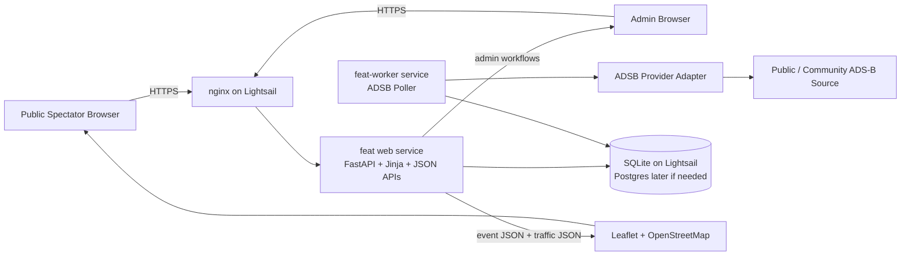

# ARCHITECTURE.md

Agent-facing architecture reference for `Flying_Event_ADSB_Tracker`.

This file describes the current system shape, the intended boundaries between components, and the important architectural constraints that should guide code changes.

## Current Runtime Shape

Current production is a single AWS Lightsail VM running:

- `nginx`
- `feat` web service
- `feat-worker` background polling service
- SQLite on the host filesystem

The public hostname is:

- `https://adsb.massiveweb.net`

The current Lightsail instance is:

- instance name: `flying-event-adsb-tracker-micro`
- bundle: `micro_3_0`
- memory: `1 GB`
- swap: `2 GB`

## Architecture Diagram

## Component Responsibilities

### nginx

Responsibilities:

- terminate HTTPS
- redirect HTTP to HTTPS
- proxy traffic to the local FastAPI web service

nginx should stay thin. Do not move application logic into nginx configuration unless the behavior is purely transport or routing related.

### `feat` web service

Responsibilities:

- public pages
- admin pages
- authenticated admin actions
- health endpoint
- public JSON responses for event state and area traffic

Constraints:

- should not run the embedded worker in production
- should read web-specific environment from `.env.web`

### `feat-worker`

Responsibilities:

- poll ADS-B provider for active events only
- normalize provider observations
- evaluate automatic `Flying` and `Arrived` transitions
- persist position and track updates

Constraints:

- should read worker-specific environment from `.env.worker`
- should not serve web traffic

### Database

Current production database:

- SQLite file on the host

Design intent:

- keep persistence behind app/domain code, not templates
- keep current schema evolution manageable through models and migrations
- retain a path to PostgreSQL later without rewriting the whole app

SQLite is acceptable for the current volunteer-scale single-host deployment, but anything that increases write pressure or operational criticality should be evaluated with PostgreSQL in mind.

### ADS-B provider layer

Responsibilities:

- isolate third-party traffic source details
- allow replacement of public/community ADS-B providers later

Constraint:

- domain logic should not know provider-specific wire formats

## Primary Code Boundaries

### Routers

- `src/app/routers/public.py`
  - public pages and public JSON endpoints
- `src/app/routers/admin.py`
  - authenticated admin UI and actions
- `src/app/routers/auth.py`
  - login and password reset flows

### Domain and polling

- `src/app/services/domain.py`
  - queue rules, state transitions, track rollover
- `src/app/services/poller.py`
  - event polling orchestration
- `src/app/services/worker.py`
  - recurring worker loop
- `src/app/services/providers.py`
  - ADS-B provider abstraction
- `src/app/worker_main.py`
  - standalone worker entrypoint

### Persistence

- `src/app/models.py`
  - SQLAlchemy models
- `migrations/`
  - migration history

## Core Domain Rules

Already implemented:

- public pages are read-only
- one airport equals one event
- one tail number belongs to one event
- passenger names are hidden publicly unless explicitly enabled per event
- `Flying` can auto-trigger when tracked aircraft is airborne within event area
- `Arrived` can auto-trigger after aircraft remains inside configured return radius for configured hold time
- admins can manually override states
- current passenger rollover archives the previous track and starts a new current track

These rules should be treated as domain behavior, not UI behavior.

## Current Operational Constraints

- cheap hosting is still a core requirement
- deployment is currently single-host and intentionally not HA
- worker and web are separated to reduce the chance that polling issues stall the web process
- Terraform currently manages the Lightsail instance and static IP cleanly
- Lightsail static IP attachment and public port rules are treated as operational concerns because provider behavior is awkward for already-attached resources

## Change Guidance

When changing the system:

- keep public/admin route separation clear
- keep provider-specific logic out of templates and routers
- prefer updating domain services for business rules
- preserve the ability to swap ADS-B providers later
- preserve the current split between web and worker runtime responsibilities

## Future Upgrade Path

Likely future moves:

- PostgreSQL instead of SQLite
- richer backup and restore runbooks
- stronger worker supervision and operational health signaling
- possible serverless/native AWS replatform if traffic justifies it

See also:

- [AGENTS.md](c:\Users\dave\Desktop\Dev Env\Flying_Event_ADSB_Tracker\AGENTS.md)
- [DEVELOPMENT.md](c:\Users\dave\Desktop\Dev Env\Flying_Event_ADSB_Tracker\DEVELOPMENT.md)
- [docs/native-aws-option.md](c:\Users\dave\Desktop\Dev Env\Flying_Event_ADSB_Tracker\docs\native-aws-option.md)
