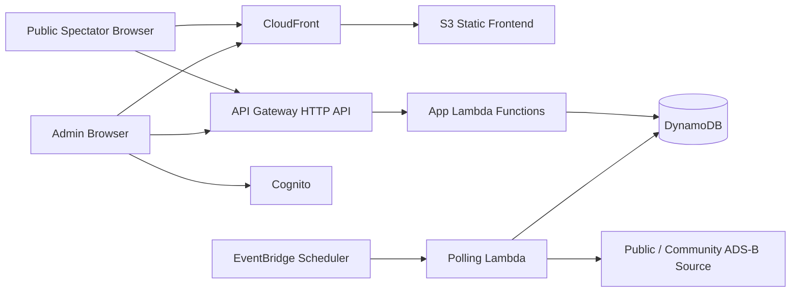

# Native AWS Option

This document evaluates a more "native AWS" architecture for `Flying_Event_ADSB_Tracker` using managed and serverless services instead of a single Lightsail VM.

## Summary

For this project, a native AWS stack is technically a very good fit:

- low idle cost
- no single tiny VM to wedge itself
- clean scaling for spectator traffic
- easier separation of web requests, polling, and data storage

The tradeoff is complexity. A native AWS build introduces more services, more deployment plumbing, more IAM, and more moving parts than the current Lightsail shape.

## Recommended Native AWS v1 Shape

### Frontend

- `S3`
  - host compiled static frontend assets
- `CloudFront`
  - serve the public/admin frontend over HTTPS
  - optional caching for static assets

### API / application layer

- `API Gateway HTTP API`
  - public JSON endpoints
  - admin API endpoints
- `AWS Lambda`
  - request handlers for public and admin actions

### Identity

- `Amazon Cognito`
  - admin authentication
  - password reset flow

### Database

Two realistic choices:

1. `DynamoDB`
   - lowest-ops managed option
   - fits the event/aircraft/passenger/state workload well
   - requires application model changes from current SQLAlchemy patterns
2. `Aurora Serverless v2` or `RDS PostgreSQL`
   - closer to the current relational model
   - easier migration from SQLAlchemy/Alembic
   - much harder to keep under the current cost target

For the current budget target, `DynamoDB` is the only native AWS data store that still feels aligned with the original "super cheap" goal.

### Background polling

- `EventBridge Scheduler`
  - trigger polling Lambdas every 1 minute or on a controlled cadence
- `Lambda`
  - poll ADS-B provider for active events only
  - process automatic `Flying` / `Arrived` transitions

### Observability

- `CloudWatch Logs`
  - Lambda logging
- `CloudWatch Alarms`
  - failure and latency alerts

## Reference Architecture

## Why This Fits The App

### Good fit

- spectator traffic is bursty, mostly around weekend events
- the app is mostly idle outside events
- polling can be restricted to active events only
- admin count is tiny
- public reads likely outnumber admin writes by a large margin

### Less ideal fit

- the current app is server-rendered FastAPI with SQLAlchemy models
- moving to native AWS pushes us toward:
  - API-first frontend
  - DynamoDB data modeling
  - Cognito integration
  - Lambda packaging/runtime concerns

So the app concept fits serverless well, but the current codebase would need a meaningful architectural refactor to get there cleanly.

## Rough Cost Picture

These are directional cost bands for `us-east-1`, not a committed bill estimate. Actual cost depends heavily on event-day spectator traffic and polling frequency.

### Very light usage

Assumptions:

- few admins
- a handful of public viewers
- only a small number of active event days
- active-event polling only

Likely cost band:

- around `$1-$5/month`

### Moderate real event usage

Assumptions:

- 2 to 3 active events some weekends
- public pages polling every 10 seconds
- several simultaneous spectators
- normal admin activity

Likely cost band:

- around `$5-$12/month`

### Heavier public traffic

Assumptions:

- lots of simultaneous public viewers
- sustained frequent polling

Likely cost band:

- can exceed the current Lightsail cost target
- biggest driver becomes API request volume, not storage

## Important Pricing Drivers

### Usually cheap

- `S3`
- `CloudFront` at low traffic
- `Cognito` for a tiny admin base
- `DynamoDB` at low request volume
- `Lambda` for modest request volume and short handlers

### Can grow faster than expected

- `API Gateway HTTP API`
- `CloudFront` data transfer if public traffic becomes substantial
- `Lambda` if handlers become heavy or numerous

The biggest serverless cost sensitivity for this app is the polling-heavy public map experience.

## Example Traffic Pressure

If a single event page does:

- one event-state request every 10 seconds
- one area-traffic request every 10 seconds

That is:

- 2 requests every 10 seconds
- 12 requests per minute
- 720 requests per hour per open viewer tab

That is still workable, but it means public spectator traffic can dominate monthly API request cost if the event becomes popular.

## Benefits Over Current Lightsail Setup

### Strong benefits

- no single VM with 0.5 GB RAM to wedge itself
- much better resilience to burst traffic
- no SSH or manual service babysitting for routine operation
- cleaner separation of frontend, API, and polling responsibilities
- easier alerting and visibility through CloudWatch

### Soft benefits

- easier future scaling if usage grows
- better security posture through managed auth and narrower runtime surfaces

## Downsides Compared To Lightsail

- more complex Terraform
- more complex local development model
- more services to reason about
- likely front-end refactor away from server-rendered pages toward API-first patterns
- DynamoDB redesign if we want native AWS to stay within the original low budget

## Best Native AWS Recommendation

If we choose the native AWS path, the best cost-conscious design is:

- frontend: `S3 + CloudFront`
- auth: `Cognito`
- API: `API Gateway HTTP API + Lambda`
- database: `DynamoDB`
- polling: `EventBridge + Lambda`

This is the most cloud-native version that still has a realistic shot at staying in the same general cost neighborhood as Lightsail.

## Not Recommended Native AWS Path

For this project, I would avoid:

- `API Gateway + Lambda + RDS PostgreSQL`
- `API Gateway + Lambda + Aurora Serverless v2`

Those can be elegant architecturally, but they are much more likely to overshoot the current budget target once the database cost is included.

## Migration Impact From Current Codebase

### Smaller lift

- move static public assets toward an API-backed frontend
- isolate public/admin API contracts
- keep domain logic conceptually similar

### Larger lift

- replace SQLAlchemy persistence model with DynamoDB access patterns
- replace current session/login flow with Cognito
- adapt background worker logic into scheduled Lambda jobs
- rethink track/history storage layout for document-style persistence

This is a meaningful replatforming effort, not a quick deployment swap.

## Recommendation

### Short-term

Stay on Lightsail, but stabilize it:

1. add swap immediately
2. move from the current `$5/month` Lightsail plan to the next size up
3. split the poller from the web process when practical

### Medium-term

If the app proves useful and gets repeated public event traffic, plan a native AWS migration to:

- `S3 + CloudFront`
- `API Gateway HTTP API`
- `Lambda`
- `DynamoDB`
- `Cognito`
- `EventBridge`

That path gives the best operational resilience without automatically implying a huge bill.

## Bottom Line

- Best immediate value: larger Lightsail instance plus swap
- Best long-term AWS-native architecture: serverless with `DynamoDB`
- Best fit for today's repo with minimum rewrite: stay on Lightsail for now

## Sources

- AWS Lambda pricing: https://aws.amazon.com/lambda/pricing/
- Amazon API Gateway pricing: https://aws.amazon.com/api-gateway/pricing/
- Amazon S3 pricing: https://aws.amazon.com/s3/pricing/
- Amazon DynamoDB pricing: https://aws.amazon.com/dynamodb/pricing/
- Amazon Cognito pricing: https://aws.amazon.com/cognito/pricing/
- AWS decision guide for Lightsail / Elastic Beanstalk / EC2: https://docs.aws.amazon.com/pdfs/decision-guides/latest/lightsail-elastic-beanstalk-ec2/lightsail-elastic-beanstalk-ec2.pdf
